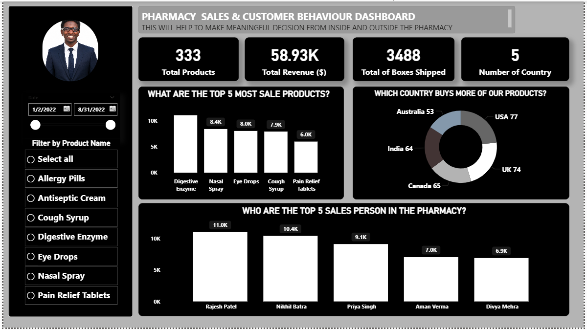

# 💊 Pharmacy Sales & Customer Behaviour Dashboard

## 📌 Overview
A **Power BI** dashboard analyzing over-the-counter (OTC) pharmacy sales data — built to help make meaningful decisions both inside and outside the pharmacy. It tracks revenue, top-selling products, top sales staff, and which countries buy the most from the pharmacy.

- **Tool used:** Power BI Desktop
- **Data table:** `pharmacy_otc_sales_data`
- **Fields used:** Product Names, Amount ($), Sales Person, Country, Date, Boxes Shipped
- **Visuals used:** KPI cards, clustered column charts, donut chart, date slicer, product-name list slicer
---

## 🎯 Objectives
- Track total revenue, product count, boxes shipped, and country reach at a glance
- Identify the top 5 best-selling products by revenue
- Identify the top 5 sales staff by total sales amount
- See which countries buy the most products
- Let users filter the whole report by date range or by a specific product

---

## 🖥️ Dashboard Walkthrough

### KPI Cards
Four summary cards give an at-a-glance view of the business (for the default date range, 1/2/2022–8/31/2022):
- **Total Products:** 333
- **Total Revenue ($):** 58.93K
- **Total of Boxes Shipped:** 3,488
- **Number of Country:** 5

### What Are the Top 5 Most Sale Products? (clustered column chart)
Ranks `Product Names` by summed `Amount ($)`:
| Product | Sales |
|---|---|
| Digestive Enzyme | ~10K |
| Nasal Spray | 8.4K |
| Eye Drops | 8.0K |
| Cough Syrup | 7.9K |
| Pain Relief Tablets | 6.0K |

### Who Are the Top 5 Sales Person in the Pharmacy? (clustered column chart)
Ranks `Sales Person` by `Total Sales Amount ($)`:
| Sales Person | Sales |
|---|---|
| Rajesh Patel | 11.0K |
| Nikhil Batra | 10.4K |
| Priya Singh | 9.1K |
| Aman Verma | 7.0K |
| Divya Mehra | 6.9K |

### Which Country Buys More of Our Products? (donut chart)
Breaks down purchases by `Country`:
| Country | Purchases |
|---|---|
| USA | 77 |
| UK | 74 |
| Canada | 65 |
| India | 64 |
| Australia | 53 |

### Filters
- **Date slicer** — filters the entire report to a selected date range (default: 1/2/2022–8/31/2022)
- **Filter by Product Name (list slicer)** — radio-button list (Allergy Pills, Antiseptic Cream, Cough Syrup, Digestive Enzyme, Eye Drops, Nasal Spray, Pain Relief Tablets, or Select all) narrowing every visual down to a single product

---

## 📈 Key Insights
- **Digestive Enzyme** is the top-selling product at roughly 10K in sales, comfortably ahead of Nasal Spray (8.4K) and Eye Drops (8.0K).
- **Rajesh Patel** leads the sales team with 11.0K in sales, followed closely by Nikhil Batra (10.4K) — together the top two reps outsell the bottom two (Aman Verma and Divya Mehra) combined.
- The **USA (77)** and **UK (74)** are the top two markets by product purchases, with Canada, India, and Australia trailing at 65, 64, and 53 respectively — demand is fairly evenly spread across five countries rather than concentrated in one.
- Total revenue of **$58.93K** was generated from **333 products** and **3,488 boxes shipped** over the default Jan–Aug 2022 window.

---

## 🛠️ Skills Demonstrated
- Power BI report design: KPI cards, clustered column charts, donut chart
- Interactive filtering with a date range slicer and a list slicer
- DAX/measure-based aggregation (`SUM`, distinct counts) for KPI cards
- Structuring a single-page dashboard around a sales & customer-behavior narrative

---

## 🚀 How to Use This Report
1. Download `pharmacy-dash.pbix`.
2. Open it in **Power BI Desktop**.
3. Use the **Date** slicer or **Filter by Product Name** list to narrow the view — all cards and charts update automatically.

---

## 📬 Contact
**Usama Abdullahi Sani**
- LinkedIn: www.linkedin.com/in/usama-abdullahi-sani-60a2b6248
- Email: usamasaniabdullahi814@gmail.com
